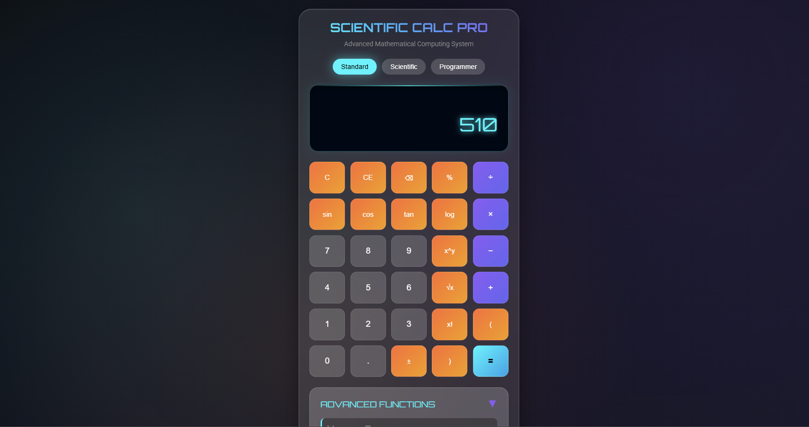

# 🔢 Scientific Calculator  

A **Scientific Calculator** built using **HTML, CSS, and JavaScript**.  
This project provides both **basic arithmetic operations** and **scientific functions** (like trigonometry, logarithms, powers, etc.), all in a responsive and user-friendly UI.  

---
Here is a preview of the calculator UI:

## 🎥 Demo Video
👉 [Watch the demo](./demo.mp4) 
